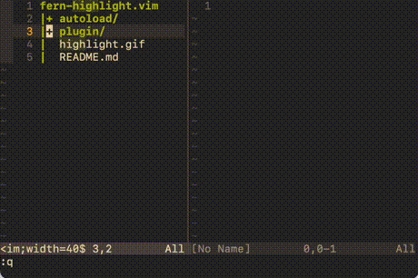

# fern-search.vim

[fern.vim](https://github.com/lambdalisue/fern.vim) plugin for full-text search/replacement in the selected folder. Requires [Ack.vim](https://github.com/mileszs/ack.vim/)

## Usage (default mapping)

| Mapping | Action                    | Description                         |
| ------- | ------------------------- | ----------------------------------- |
| `ms`    | `search`                  | Search                              |
| `mS`    | `search-sensetive`        | Search (case sensetive)             |
| `mr`    | `search-replace`          | Replace                             |
| `mR`    | `search-replace-sensetive`| Replace (case sensetive)            |
